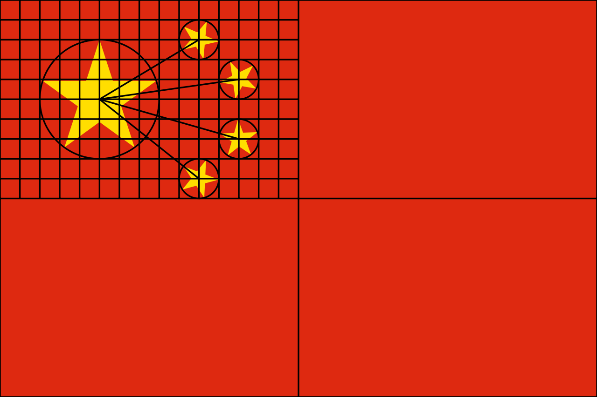

# 绘制国旗

初识：画红色矩形，1个大五角星，4个小五角星。

**注意**：国旗有标准，画图需谨慎！

背景知识：

>根据1949年9月28日中国人民政治协商会议第一届全体会议主席团公布的《国旗制法说明》，中华人民共和国国旗旗面为红色，长方形，其长与高为三与二之比，旗面左上方缀黄色五角星五颗。一星较大，其外接圆直径为旗高十分之三，居左；四星较小，其外接圆直径为旗高十分之一，环拱于大星之右。旗杆套为白色（[来自百度百科](https://baike.baidu.com/item/%E4%B8%AD%E5%8D%8E%E4%BA%BA%E6%B0%91%E5%85%B1%E5%92%8C%E5%9B%BD%E5%9B%BD%E6%97%97/240342#3_2)）。

>《国旗法》对国旗的制作有明确规范。国旗尺寸分6种规格（单位CM）：
1号，288×192；
2号，240×160；
3号，192×128；
4号，144×96；
5号，96×64；
6号，66×44

>五角星绘制方法：
1. 先将旗面划分为4个等分长方形。
1. 将左上方长方形划分长宽15×10个方格。
1. 大五角星的中心位于该长方形上5下5、左5右10之处。大五角星外接圆的直径为6单位长度。
1. 四颗小五角星的中心点，第一颗位于上2下8、左10右5，第二颗位于上4下6、左12右3，第三颗位于上7下3、左12右3，第四颗位于上9下1、左10右5之处。
1. 每颗小五角星外接圆的直径均为2单位长度。四颗小五角星均有一角尖正对大五角星的中心点。如下图：


## 引入模块


```python
import turtle as t
```

## 定义尺寸


```python
#定义尺寸
qw, qh = 660, 440                   # 国旗长宽
dt = 330/15                         # 一个小格
bx, by = -330 + dt*5, 220 - dt*5    # 大五角星（中心坐标）
br, sr = dt*3, dt*1                 # 大五角星半径，小五角星半径
```

## 函数：画矩形


```python
def draw_square(x1, y1, x2, y2):
    '起点和终点坐标'
    print('画矩形', x1, y1)
    t.up()
    t.setpos(x1, y1)    # 从左下角开始绘制，同goto
    t.down()
    t.color('red', 'red')
    t.begin_fill()
    t.fd(x2 - x1)
    t.lt(90)
    t.fd(y2 - y1)
    t.lt(90)
    t.fd(x2 - x1)
    t.lt(90)
    t.fd(y2 - y1)
    t.end_fill()
```


```python
# 测试
t.speed(10)
draw_square(-qw/2, -qh/2, qw/2, qh/2)
t.ht()
t.done()
```

## 函数：画五角星


```python
def draw_star(center_x, center_y, heading, radius):  
    '中心坐标，顶点朝向，半径'
    print('画五角星', center_x, center_y, heading, radius)   #调试信息
    t.pencolor('yellow')  
    t.tracer(False)
    # 计算顶点
    t.up()
    t.setpos(center_x, center_y)
    t.seth(heading)
    t.fd(radius)    # 移动到上顶点
    t.rt(90)
    pt1 = t.pos()
    t.circle(-radius, 360 / 5)  
    pt2 = t.pos()
    t.circle(-radius, 360 / 5)  
    pt3 = t.pos()
    t.circle(-radius, 360 / 5)  
    pt4 = t.pos()
    t.circle(-radius, 360 / 5)  
    pt5 = t.pos()
    t.down()
    t.tracer(True)
    # 画图
    t.color('yellow', 'yellow')  
    t.begin_fill()  
    t.goto(pt3)  
    t.goto(pt1)  
    t.goto(pt4)  
    t.goto(pt2)  
    t.goto(pt5)  
    t.end_fill()
```


```python
# 测试
t.speed(1)
draw_star(0, 0, 90, 60)
t.ht()
t.done()
```


    ---------------------------------------------------------------------------

    NameError                                 Traceback (most recent call last)

    <ipython-input-8-a417613370aa> in <module>
          1 # 测试
    ----> 2 t.speed(1)
          3 draw_star(0, 0, 90, 60)
          4 t.ht()
          5 t.done()
    

    NameError: name 't' is not defined


## 小五角星位置


```python
def calc_s_star(xx, yy):
    '坐标格'
    t.up()
    x, y = -330 + dt*xx, 220 - dt*yy
    t.goto(x, y)
    ang = t.towards(bx, by)
    return (x, y, ang, sr)
```

# 画图


```python
t.speed(8)
draw_square(-qw/2, -qh/2, qw/2, qh/2)

#大五角星
draw_star(bx, by, 90, br)
#小五角星1
r = calc_s_star(10, 2)
draw_star(*r)
#小五角星2
r = calc_s_star(12, 4)
draw_star(*r)
#小五角星3
r = calc_s_star(12, 7)
draw_star(*r)
#小五角星4
r = calc_s_star(10, 9)
draw_star(*r)

t.ht()
t.done()
```

    画矩形 -330.0 -220.0
    画五角星 -220.0 110.0 90 66.0
    画五角星 -110.0 176.0 210.9637565321 22.0
    画五角星 -66.0 132.0 188.1301023542 22.0
    画五角星 -66.0 66.0 164.0546040991 22.0
    画五角星 -110.0 22.0 141.3401917459 22.0
    
